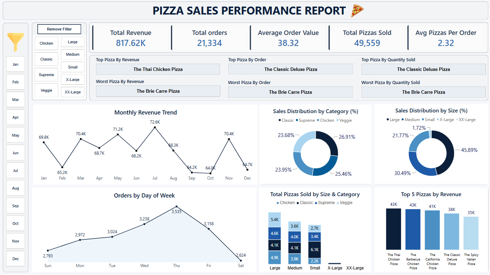
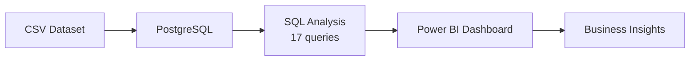

# Pizza Sales Performance Analysis

Analyzed **48,000+ pizza orders** and **$817K in revenue** — then built an interactive Power BI dashboard to show what's working and what isn't.




*Interactive Power BI dashboard with filters for month, category, and size.*

## Project at a Glance

| Item | Detail |
|------|--------|
| **Dataset** | 48,606 line items · 21,334 orders · Jan – Dec 2025 |
| **Products** | 32 pizzas · 4 categories · 5 sizes (S–XXL) |
| **SQL Analysis** | 17 queries · 5 KPIs (PostgreSQL) |
| **Deliverables** | Interactive Power BI dashboard · SQL report |

## Business Problem

A pizza business needs to understand what drives sales across time, categories, sizes, and menu items. This project answers:

- How much revenue are we generating, and when do orders peak?
- Which pizzas and sizes contribute most to sales?
- Where should the business focus marketing, staffing, and menu decisions?

## Workflow



## Key Insights

- **$817.6K revenue** from **21,334 orders** — AOV **$38.32**, **2.32** pizzas per order.
- **Thursday** peaks for orders (3,535); **May** (~$71.2K) and **July** (~$72.6K) peak for revenue.
- **Large** pizzas drive **45.9%** of sales; Medium **30.5%**, Small **21.8%**.
- ***The Thai Chicken Pizza*** leads revenue; chicken pizzas (Thai, BBQ, California) dominate the top list. ***The Brie Carre Pizza*** ranks lowest across revenue, orders, and quantity.

## Business Recommendations

- **Review Brie Carre** — lowest performer across all metrics; review pricing, placement, or removal.
- **Staff and stock for peaks** — prioritize Thursdays and summer months (May–July).
- **Focus promotions on Large pizzas** — bundles and upsell opportunities.

## Tech Stack

| Tool | Purpose |
|------|---------|
| **SQL** | KPIs, trends, distributions, top/bottom analysis |
| **PostgreSQL** | Data storage and query execution |
| **Power BI** | Interactive dashboard and stakeholder reporting |

## Getting Started

1. **Dashboard** — Open `dashboard/pizza_sales.pbix` in Power BI Desktop. If prompted for a data source, browse to `data/pizza_sales.csv` in the cloned repo.
2. **SQL** — Run `sql/pizza_sales.sql` in PostgreSQL (17 queries: KPIs, trends, top/bottom products).
3. **Report** — See `docs/pizza_sales_sql_report.docx` for the full write-up.

## Project Structure

```
pizza-sales-analysis/
├── dashboard/
│   ├── pizza_sales.pbix
│   └── dashboard_preview.png
├── data/
│   └── pizza_sales.csv
├── sql/
│   └── pizza_sales.sql
└── docs/
    └── pizza_sales_sql_report.docx
```

---

## Author

**Abdul Rehman**  
Data Analyst

[](https://www.linkedin.com/in/abdul-rehman-6300a8221/)
[](https://github.com/rehman1976)

---

*Licensed under the [MIT License](LICENSE).*
